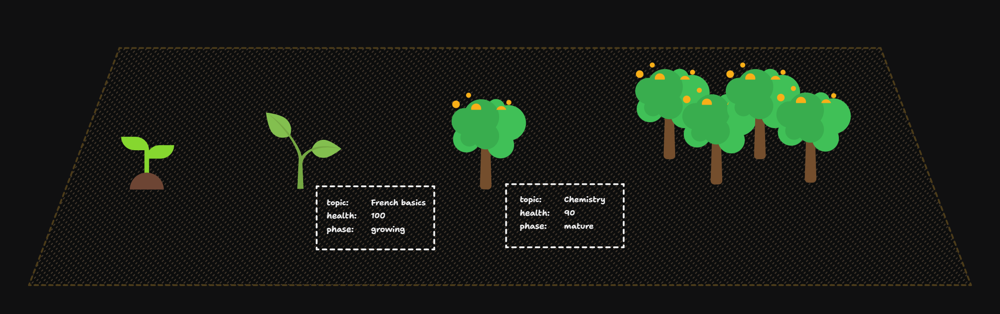

# Flashmemo

Test your knowledge and memorize by using flash cards! 🟦🟩🟨

This project learning mode is based on the *Trees Rewards System* where users can earn seeds by **solving questions**, build their garden by planting **trees of the subject/matter** they've being studying and harvest them to earn bonus to **forest their knowledge** 🌲.

### Features

- Exams (collection of questions)
- Questions 
  - True vs False
  - multiple options
  - Duo combination
- User account creation and signin in via JWT
- User Progress by period (monthly, yearly, semester)
- Categories
- Revisions
- Rewards System (Trees, Gardens, Seeds)

See doc for [API](./api/README.md)